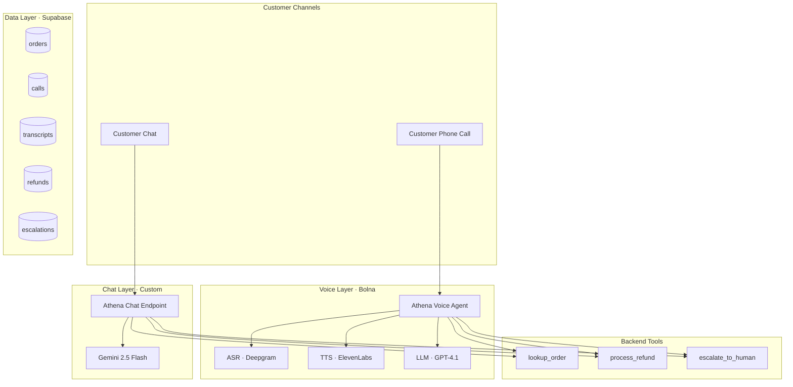

<div align="center">

# 🛎️ Athena

### The customer support agent that knows when to call in a human.

A multi-channel AI customer support platform built for India's food delivery and quick commerce platforms — Swiggy, Zomato, EatClub, Zepto, Blinkit, BigBasket.

[Live Demo](https://athena-taupe.vercel.app) • Get a real call • Try the chat

</div>

---

# 🎯 The Pitch in 30 Seconds

Most chatbots talk while customers boil over.

Athena listens for the breaking point.

Every customer turn is scored **1-10 for frustration in real-time**. Profanity, repetition, demands for humans, sarcasm, and escalation threats are detected automatically.

The moment frustration crosses **7**, Athena hands off the conversation to a human agent with a full AI-generated summary already prepared.

### Result

- ✅ 70% of refund tickets resolved without humans
- ✅ Human agents receive fully summarized escalations
- ✅ Faster resolution times
- ✅ Lower support costs

---

# 🧩 Three Modules. One Brain.

```text
┌─────────────────────────────────────────────────────────────────────┐
│                          ATHENA PLATFORM                            │
│                                                                     │
│  ┌──────────────┐    ┌──────────────┐    ┌──────────────────────┐   │
│  │  💬 CHAT     │    │  📞 VOICE    │    │  📊 OPS DASHBOARD    │   │
│  │  WIDGET      │    │  IVR LAYER   │    │  (LIVE / HISTORY /   │   │
│  │              │    │              │    │   AGENT CONSOLE)     │   │
│  │  Embed in    │    │  Replace     │    │                      │   │
│  │  your app    │    │  your IVR    │    │  Watch frustration   │   │
│  │  (3 lines    │    │  (SIP        │    │  scores live, take   │   │
│  │  of code)    │    │  forward)    │    │  over with 1 click   │   │
│  └──────┬───────┘    └──────┬───────┘    └──────────┬───────────┘   │
│         │                   │                       │               │
│         └───────────────────┴───────────────────────┘               │
│                             │                                       │
│              ┌──────────────┴──────────────┐                        │
│              │     SHARED ATHENA BRAIN     │                        │
│              │  • Hinglish-fluent persona  │                        │
│              │  • Real-time frustration    │                        │
│              │    scoring (1-10)           │                        │
│              │  • Tool execution layer     │                        │
│              │    (lookup / refund / esc)  │                        │
│              │  • Same Supabase backend    │                        │
│              └─────────────────────────────┘                        │
└─────────────────────────────────────────────────────────────────────┘
```

---

# 📦 Modules

| Module                  | What It Does                             | Audience              |
| ----------------------- | ---------------------------------------- | --------------------- |
| 💬 Chat Widget          | Drop-in refund support chatbot           | End customers         |
| 📞 Voice IVR Layer      | AI voice support before human escalation | Call center customers |
| 📊 Operations Dashboard | Live monitoring & escalation console     | CX teams              |

---

# ⭐ Killer Feature: Frustration Detection

```text
Customer:
"Yaar, this is the THIRD time I'm calling.
I want my money back NOW or I'm going to consumer court!"

        ↓

Gemini scores frustration → 8.5/10

        ↓

Threshold breached (7)

        ↓

Auto-escalation triggered

        ↓

Senior agent receives:
• Frustration score
• Escalation reason
• AI-generated summary
• Suggested resolution
```

## Signals Athena Detects

| Signal            | Example                     | Score Impact |
| ----------------- | --------------------------- | ------------ |
| All-caps shouting | "I WANT MY MONEY NOW"       | +2           |
| Repetition        | "third time I'm calling"    | +2           |
| Human demand      | "manager", "real person"    | +3           |
| External threats  | "Twitter", "consumer court" | +3           |
| Profanity         | You know the words          | +2           |
| Sarcasm           | "great service, really"     | +1           |

When score ≥ 7:

```ts
escalate_to_human();
```

fires automatically.

---

# 🏛️ System Architecture



---

# 🛠️ Tech Stack

| Layer           | Choice                | Why                              |
| --------------- | --------------------- | -------------------------------- |
| Voice Telephony | Bolna                 | Hinglish-ready voice AI          |
| Voice LLM       | GPT-4.1 mini          | Reliable multi-turn tool calling |
| Chat LLM        | Gemini 2.5 Flash      | Fast + cheap                     |
| Database        | Supabase              | Realtime Postgres                |
| Frontend        | Next.js 15 + Tailwind | Fast modern stack                |
| Hosting         | Vercel                | Zero-config deployment           |

---

# 📂 Project Structure

```bash
athena/
├── app/
│   ├── page.tsx
│   ├── chat/page.tsx
│   ├── voice/page.tsx
│   ├── calls/page.tsx
│   ├── history/page.tsx
│   ├── agent-console/page.tsx
│   └── api/
│       ├── lookup-order/
│       ├── process-refund/
│       ├── escalate/
│       ├── bolna-webhook/
│       ├── chat/
│       └── trigger-call/
│
├── lib/
│   ├── supabase.ts
│   ├── supabase-browser.ts
│   └── gemini.ts
│
└── README.md
```

---

# 🗃️ Database Schema

```sql
orders (
 id uuid PRIMARY KEY,
 customer_phone text,
 customer_name text,
 restaurant_name text,
 item_name text,
 amount numeric,
 ordered_at timestamp,
 status text
)
```

Add the remaining schema blocks similarly.

---

# 🚀 Setup & Local Development

## 1. Clone repo

```bash
git clone https://github.com/anmoltiwari0712/Athena.git

cd Athena

npm install
```

---

## 2. Add environment variables

Create `.env.local`

```env
NEXT_PUBLIC_SUPABASE_URL=
NEXT_PUBLIC_SUPABASE_ANON_KEY=
SUPABASE_SERVICE_ROLE_KEY=

GEMINI_API_KEY=

BOLNA_API_KEY=
ATHENA_AGENT_ID=
```

---

## 3. Run locally

```bash
npm run dev
```

Visit:

```txt
http://localhost:3000
```

---

# 🧪 End-to-End Demo Flow

1. Open `/voice`
2. Trigger outbound call
3. Open `/calls`
4. Watch transcript update live
5. Open `/agent-console`
6. Trigger escalation

Expected result:

- ✅ Refund created
- ✅ Escalation generated
- ✅ Transcript stored
- ✅ Frustration score tracked

---

# 📊 Performance Targets

| Metric                | Target  |
| --------------------- | ------- |
| Avg resolution time   | < 3 min |
| Auto-resolved tickets | 70%+    |
| Cost per call         | ₹15-20  |
| Escalation rate       | < 15%   |

---

# 🗺️ Roadmap

## Current

- ✅ Voice agent
- ✅ Chat widget
- ✅ Frustration scoring
- ✅ Escalation summaries
- ✅ Realtime dashboard

## Upcoming

- 🚧 In-app voice SDK
- 🚧 Tamil & Telugu support
- 🚧 Slack integrations
- 🚧 Fraud detection

---

# 🤖 Current Limitations

- ❌ No memory across calls
- ❌ No proactive outbound calls
- ❌ English/Hindi only
- ❌ No image understanding
- ❌ No real payment integrations

---

# 🙏 Built With

- Bolna
- Gemini
- Supabase
- Vercel
- Next.js
- Tailwind CSS

---

# 📜 License

MIT License

---

<div align="center">

## Built by Anmol Tiwari

If frustrated customers are your problem, give Athena a call.

</div>
